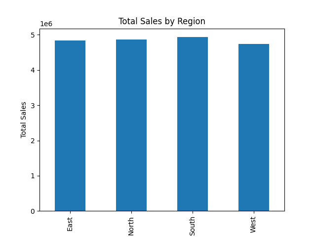
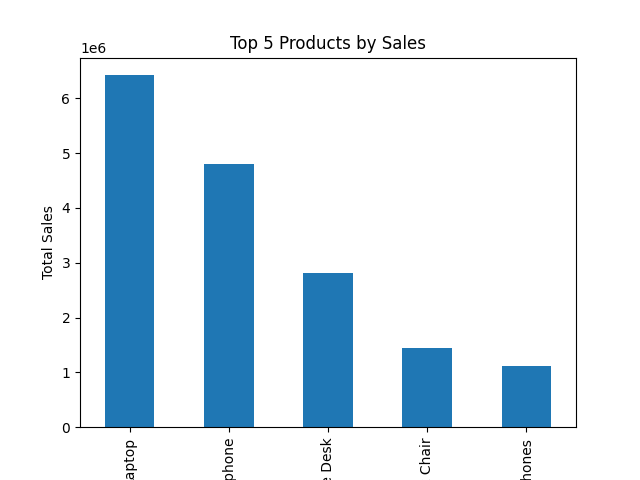
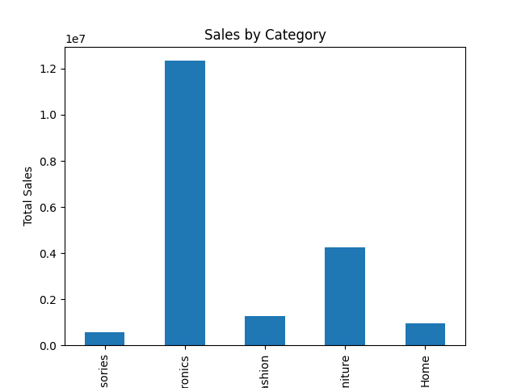
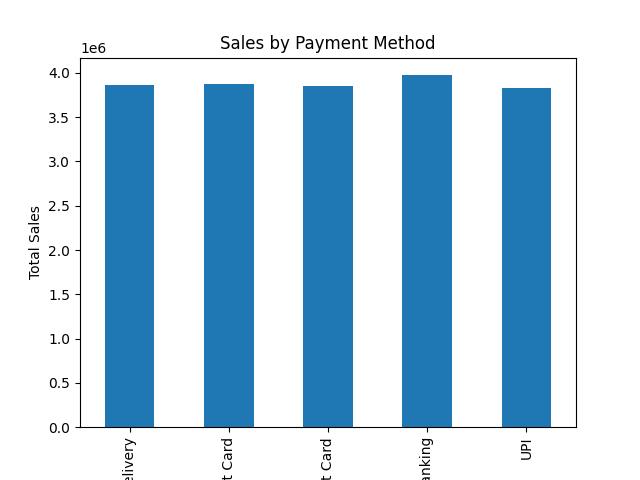
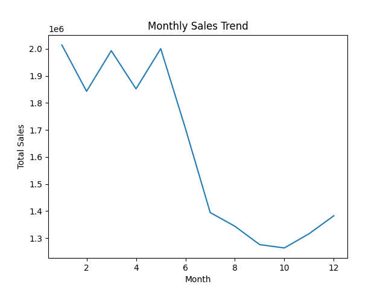

# 🐍 Customer Sales Data Analysis Using Python

## Business Problem

Businesses generate large amounts of sales data every day. The objective of this project was to analyze customer sales transactions and identify patterns in product performance, regional sales, customer purchasing behavior, and payment preferences to support data-driven decision-making.

## Project Overview

This project analyzes customer sales data using Python, Pandas, and Matplotlib. The analysis focuses on understanding sales performance, product trends, regional performance, payment methods, and monthly sales patterns through data visualization and exploratory data analysis (EDA).

## Tools Used

* Python
* Pandas
* Matplotlib
* Jupyter Notebook

## Dataset Description

The dataset contains over 30,000 sales records with the following fields:

* OrderID
* Product
* Category
* Price
* Quantity
* TotalSales
* Region
* City
* PaymentMethod
* OrderDate

## Project Workflow

1. Data Collection
2. Data Cleaning and Preprocessing
3. Exploratory Data Analysis (EDA)
4. Sales Trend Analysis
5. Data Visualization
6. Business Insights Generation

## Visualizations

### Regional Sales Analysis

### Top Selling Products

### Category-wise Sales Analysis

### Payment Method Analysis

### Monthly Sales Trend

## Key Insights

* South region generated the highest overall revenue among all regions.
* Product performance analysis identified the highest revenue-generating products.
* Category-wise analysis highlighted the most profitable product segments.
* Digital payment methods such as UPI and Credit Card were preferred by customers.
* Monthly sales trends revealed fluctuations in customer purchasing behavior throughout the year.
* Visual analysis helped identify sales patterns and business opportunities.

## Skills Demonstrated

* Python Programming
* Pandas
* Matplotlib
* Data Cleaning
* Data Preprocessing
* Exploratory Data Analysis (EDA)
* Data Visualization
* Business Insights Generation
* Trend Analysis

## Project Structure

Customer-Sales-Analysis-Python

├── dataset/
│   └── customer_sales_dataset.csv

├── visuals/
│   ├── region_sales.png
│   ├── top_products.png
│   ├── category_sales.png
│   ├── payment_sales.png
│   └── monthly_sales.png

├── sales_analysis.ipynb
└── README.md

## Conclusion

This project demonstrates how Python can be used to transform raw sales data into meaningful business insights. Through data cleaning, exploratory analysis, and visualization, the project highlights customer behavior, sales trends, and product performance, helping support data-driven business decisions.

## Author

**Krunal Patil**

MCA Graduate | Aspiring Data Analyst

### Skills
SQL | Power BI | Excel | Python | Data Visualization | Data Analytics | Machine Learning

### Connect With Me

📧 Email: pkrunalpatil26@gmail.com

💼 LinkedIn: https://linkedin.com/in/krunal-patil-ab10172b9

💻 GitHub: https://github.com/Krunalpatil15

I am passionate about transforming raw data into meaningful insights through analytics, visualization, and business intelligence.
